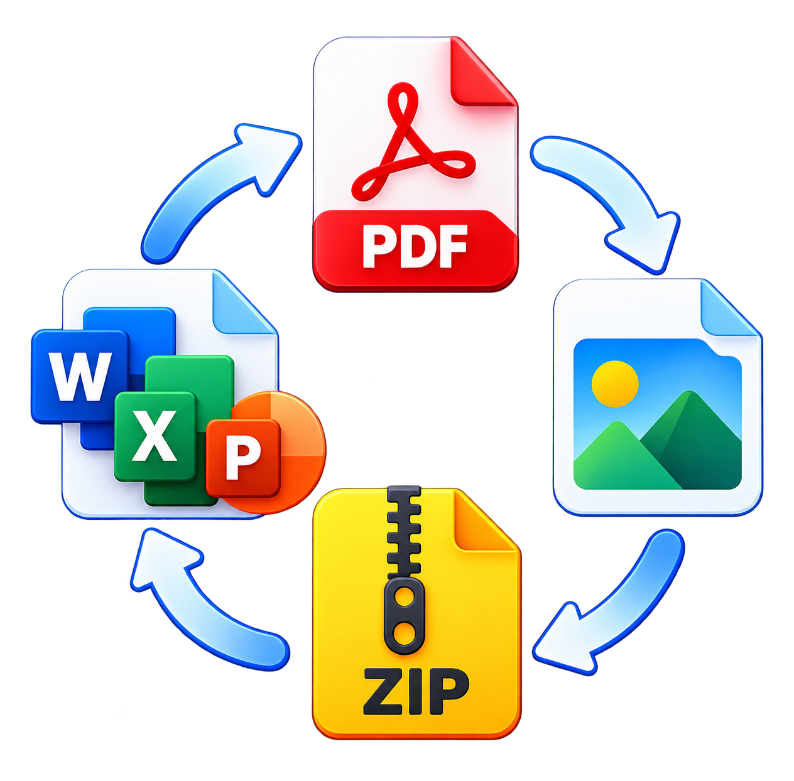
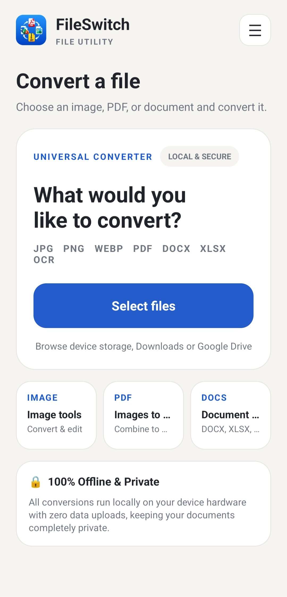
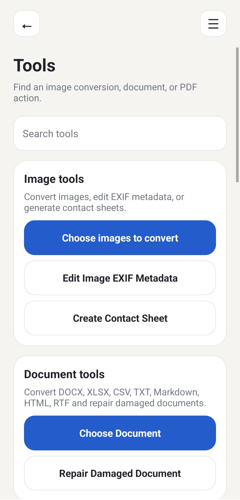
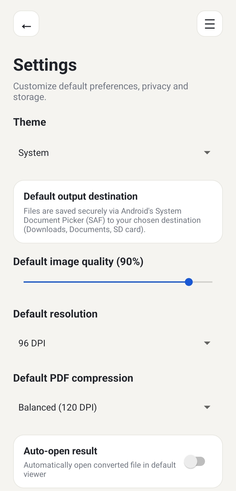

<div align="center">
  
  <h1>FileSwitch for Android</h1>
  <p><strong>Fast, privacy-focused, 100% offline file conversion and manipulation utility for Android.</strong></p>
  <p>
    <a href="app/build/outputs/apk/debug/FileSwitch.apk">
      
    </a>
  </p>
</div>

---

## Overview

FileSwitch is a native Android application for converting, transforming, repairing, and managing files locally on your device. Designed with privacy as a foundational principle, all processing is executed 100% on-device without telemetry, background network requests, or third-party servers.

- **Developer**: Sankalp
- **Repository**: [https://github.com/verma-sankalp/FileSwitch-Android](https://github.com/verma-sankalp/FileSwitch-Android)
- **Minimum Requirement**: Android 7.0 (API level 24+)
- **Target Platform**: Android 14 (API level 34)

---

## Screenshots

<div align="center">
  <table>
    <tr>
      <td align="center" width="33%">
        <sub><strong>Convert & Universal Hub</strong></sub><br/>
        
      </td>
      <td align="center" width="33%">
        <sub><strong>Tools & Advanced Utilities</strong></sub><br/>
        
      </td>
      <td align="center" width="33%">
        <sub><strong>Preferences & Settings</strong></sub><br/>
        
      </td>
    </tr>
  </table>
</div>

---

## Features

### 🖼️ Images & EXIF Tools
- **Formats Supported**: JPG, PNG, WebP, BMP, SVG, and HEIC/HEIF.
- **Conversion Targets**: PNG, JPG, WebP, or multi-page PDF.
- **Image Transformations**: Scale/resize (25%–200%), center-crop, rotate 90°, flip horizontal/vertical, grayscale conversion, and lossy compression quality tuning (0%–100%).
- **EXIF Metadata Editor**: Inspect and edit image description, artist, copyright, camera make, and camera model.
- **GPS Privacy Scrubbing**: Strip sensitive location coordinates (latitude, longitude, altitude, and timestamps) before sharing.
- **Contact Sheet Generator**: Multi-select images and generate clean, customizable grid contact sheets (2×N, 3×N, 4×N) with bordered thumbnails and labels.
- **Animated GIF**: Dedicated **GIF (keep animation)** mode preserves frame animations without destructive re-encoding.
- **Custom DPI Export**: Configurable output resolutions (72, 96, 150, 300, and 600 DPI).

---

### 📄 Comprehensive PDF Suite
- **Page Operations**:
  - Merge multiple PDFs into one document.
  - Split PDFs into individual single-page files.
  - Extract specific page ranges (e.g., `1-5, 8, 10-12`), All, Odd, or Even pages.
  - Delete selected pages safely.
  - Reorder pages in custom sequences.
  - Rotate pages (90° clockwise, 180°, 270°).
  - Resize pages to standard dimensions (A4 portrait/landscape, Letter portrait/landscape).
  - Crop page margins with custom point offsets.
  - Insert image overlays on chosen pages.
- **Advanced PDF Tools**:
  - **PDF/A Archival Conversion**: Create ISO-compliant PDF/A-1b documents with embedded XMP metadata packets.
  - **PDF Repair**: Clean corrupted page trees and rescue uncorrupted page objects.
  - **Stamps & Watermarks**: Apply diagonal watermarks (`CONFIDENTIAL`, `APPROVED`, `DRAFT`) or header/footer banners with rotation matrices.
  - **Interactive Form Filling**: Fill AcroForm field values (`FieldName=Value`) and flatten forms to make them read-only.
  - **Visual Digital Signatures**: Place styled signature stamps with signer details and localized verification timestamps.
  - **PDF Metadata Editing**: Modify Title, Author, Subject, Keywords, and update modification dates.
  - **Security**: Protect PDFs with 128-bit encryption (toggle printing, copying, editing permissions) and remove passwords from unlocked PDFs.
  - **PDF Details**: View embedded metadata, PDF version, page counts, and dimensions.

---

### 🔍 Multilingual On-Device Vision OCR
- **Supported Scripts & Languages**:
  - **Latin**: English, Spanish, French, German, and European languages.
  - **Devanagari**: Hindi, Marathi, Sanskrit.
  - **Chinese**: Simplified and Traditional characters.
  - **Japanese**: Kanji, Hiragana, Katakana.
  - **Korean**: Hangul.
- **Output Options**:
  - Extract text directly to Plain Text (`.txt`).
  - Convert recognized text to structured Word Documents (`.docx`).
  - Generate **Searchable PDFs** with invisible selectable text layers overlaid on original page images.

---

### 📑 Document Conversions & Repair
- **Office Formats**: DOCX, XLSX, XLS, PPTX, ODT, CSV, TXT, Markdown, HTML, RTF.
- **Conversion Matrix**:
  - DOCX ➔ TXT, HTML, PDF.
  - XLSX & XLS ➔ CSV, XLSX, PDF.
  - PPTX & ODT ➔ TXT, HTML, DOCX, PDF.
  - CSV ➔ XLSX, PDF.
  - TXT, Markdown, HTML, RTF ➔ DOCX, PDF, TXT, HTML.
- **Document Text Salvager & Repair**: Extracts structural XML or performs raw binary sweeps over damaged or truncated Office files (`<w:t>`, `<t>`, `<text:p>`) and reconstructs a clean `.docx` file.

---

### 📦 Archive Streaming Engine
- **Supported Formats**: ZIP, TAR, GZ, and TAR.GZ / TGZ.
- **Create Archives**: Package multiple files into secure, zip-slip protected ZIP archives.
- **Extract Archives**: Extract archives with path validation, zip-bomb protection (500 MB limit), and automatic filename conflict resolution.

---

### ⚙️ History & Settings Suite
- **Conversion History**:
  - Logs up to 30 recent conversions with timestamp, source & target formats, and file sizes.
  - Success/failed badges with error details.
  - Quick action buttons to **Re-open** (`ACTION_VIEW`) or **Share** (`ACTION_SEND`) outputs.
  - Individual entry deletion and "Clear All" with confirmation.
- **Settings Suite**:
  - **Appearance**: System Default, Light Theme, Dark Theme.
  - **Default Output Folder**: SAF destination picker and scoped storage configuration.
  - **Default Quality Slider**: Set default image compression level (0–100%).
  - **Default DPI Selector**: Set global DPI preset (72–600 DPI).
  - **PDF Compression Presets**: Low, Balanced, or High presets.
  - **Auto-open Result**: Automatically open converted files with default apps.
  - **History Toggle**: Enable/disable conversion history tracking.
  - **Cache Cleanup**: Free temporary working files and cache with one tap.
  - **About & Open Source Licenses**: View app details and third-party library credits.

---

## Architecture & Security

- **Magic-Byte Binary Detection**: Sniffs binary file signatures (`JPG`, `PNG`, `WebP`, `BMP`, `GIF`, `PDF`, `SVG`, `HEIC/HEIF`, `ZIP`, `TAR`, `GZ`) before decoding rather than relying on file extensions alone.
- **Android Scoped Storage**: Uses Android's Storage Access Framework (`ACTION_OPEN_DOCUMENT`, `ACTION_CREATE_DOCUMENT`) without requesting broad storage permissions (`MANAGE_EXTERNAL_STORAGE`).
- **Temporary Cache Isolation**: Working files reside in app-private cache and are shared securely via `SharedFileProvider` with temporary URI read permissions.
- **Zero Telemetry**: No network requests, analytics, crash reporters, or external tracking SDKs.

---

## Download & Installation

### 📲 Download APK
- **Direct Download**: [`FileSwitch.apk`](app/build/outputs/apk/debug/FileSwitch.apk)
- **Releases**: Check the [GitHub Releases](https://github.com/verma-sankalp/FileSwitch-Android/releases) page for the latest stable `.apk` binaries.

---

### 🛠️ Building from Source

#### Requirements
- Java 17+
- Android SDK Platform 34
- Android Build Tools 34.0.0

#### Build Command
Run the Gradle wrapper:

```bash
./gradlew assembleDebug
```

The APK binary will be compiled to:
```text
app/build/outputs/apk/debug/FileSwitch.apk
```

---

## Technology Stack

- **Platform**: Pure Java with Android SDK 34 (Android 7.0+ / API 24 minimum).
- **PDF Engine**: PDFBox-Android (Apache 2.0).
- **Vector Graphics**: AndroidSVG (Apache 2.0).
- **Machine Learning**: Google ML Kit On-Device Vision (Latin, Devanagari, Chinese, Japanese, Korean).
- **Spreadsheet Parsing**: Lightweight Apache POI Android.
- **Metadata**: AndroidX ExifInterface.
- **Optimizer**: R8 Full Mode with resource shrinking and ProGuard optimization.

---

For Any Queries, Contact - sankalpverma2111@gmail.com
